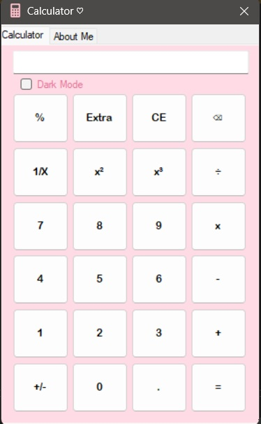
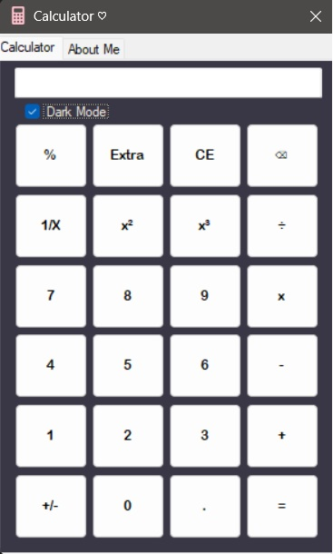

# Windows Forms Calculator

A simple, user-friendly calculator built with C# and WinForms. This application features standard mathematical operations, dark mode functionality, and a clean user interface designed for Windows desktop environments.

## Features
- Perform basic arithmetic (addition, subtraction, multiplication, division).
- Support for advanced functions:
  - Exponentiation (x^y).
  - Square, cube, and percentage calculations.
  - Inversion and sign toggle.
- Dark mode toggle for a modern user experience.

## Technology Stack
- **Language:** C#
- **Framework:** .NET Framework (WinForms)
- **IDE:** Visual Studio

## How to Run
1. Clone the repository:
   ```bash
   git clone https://github.com/berlinernesse/calculator.git
2. Open the solution file (calculator.sln) in Visual Studio 
3. Build and run the application.

## Screenshots


